<!-- ╔══════════════════════════════════════════════════════════════╗
     ║              DIEGO LIAL — GITHUB PROFILE README             ║
     ╚══════════════════════════════════════════════════════════════╝ -->


<!-- ═══════════════ AI INTELLIGENCE ANALYST ═══════════════ -->
<div align="center">
  
</div>

<div align="center">
  
</div>

<p align="center">
  <a href="https://github.com/DiegoLial?tab=followers">
    
  </a>&nbsp;
  <a href="https://github.com/DiegoLial?tab=repositories">
    
  </a>&nbsp;
  <a href="https://t.me/DiegoLial">
    
  </a>&nbsp;
  
</p>

<!-- ═══════════════ NAVEGAÇÃO ═══════════════ -->

<p align="center">
  <a href="#-sobre-mim">Sobre</a> · 
  <a href="#%EF%B8%8F-segurança-pública--govtech">Segurança Pública</a> · 
  <a href="#-o-que-eu-construo">O que construo</a> · 
  <a href="#-projetos-públicos">Projetos</a> · 
  <a href="#-case-studies-privados">Cases privados</a> · 
  <a href="#-stack-tecnológica">Stack</a> · 
  <a href="#-métricas-github">Métricas</a> · 
  <a href="#-contato">Contato</a>
</p>

---

## 🧑‍💻 Sobre mim

```python
class DiegoLial:
    role       = "Full Stack Developer"
    location   = "Manaus, AM 🇧🇷"
    languages  = ["pt-BR", "en"]
    
    focus = [
        "Sistemas completos (front → back → deploy → observabilidade)",
        "Segurança Pública: inteligência, auditoria, gestão operacional",
        "Automação: bots, pipelines, integrações, webhooks",
        "Cripto: análise técnica, alertas e monitoramento via API",
    ]
    
    currently = "Construindo produtos que rodam em produção e resolvem problemas reais."
```

---

## 🛡️ Segurança Pública · GovTech

<table>
<tr>
<td width="80" align="center">🏛️</td>
<td>

Desenvolvo e mantenho **sistemas de missão crítica** para órgãos de segurança pública, com foco em:

</td>
</tr>
</table>

<div align="center">

| Domínio | O que entrego |
|:---:|:---|
| 🔐 **Controle de Acesso** | RBAC multi-nível, RLS por tabela, segregação de dados, aprovação de usuários |
| 🧾 **Auditoria & Compliance** | Logs imutáveis, trilhas de auditoria, rastreabilidade de ações (quem/quando/o quê) |
| 📊 **Dashboards Operacionais** | KPIs em tempo real, métricas de produtividade, rankings e gamificação |
| 🗺️ **Geointeligência** | Mapas interativos, geocodificação, clusters, territórios e organogramas |
| 📄 **Relatórios & Documentos** | Geração automatizada de PDF/TXT, ofícios com numeração, exportação padronizada |
| 🔗 **Integrações Institucionais** | APIs externas (BACEN, ViaCEP, Nominatim), consultas financeiras, processamento de filas |
| ⚙️ **Módulos de Gestão** | Investigação, cartório, produtividade, operações, inquéritos, apreensões |

</div>

> **⚠️ Repositórios e detalhes técnicos são privados** por motivos de segurança e confidencialidade institucional.  
> Abaixo estão descrições de alto nível sem exposição de dados sensíveis.

<details>
<summary><b>📌 Sistema de Gestão Policial — 4 módulos integrados</b></summary>
<br/>

- **Cartório**: dashboards estatísticos, entrada de dados, relatórios com comparativo anual
- **Investigação**: operações, investigados, diligências, inquéritos, apreensões, presos, mapa com Mapbox, organograma de facções
- **Produtividade**: metas, tarefas (kanban), pontuação/gamificação com triggers automáticos
- **Ofícios**: geração com numeração automática por setor, banco de 400+ contatos
- **Segurança**: RLS em 42 tabelas, 5 roles, aprovação de usuários, edge functions
- Stack: `React` · `Vite` · `TypeScript` · `Supabase` · `Mapbox` · `PWA`

</details>

<details>
<summary><b>📌 Sistema de Inteligência — NestJS enterprise-grade</b></summary>
<br/>

- Gestão de investigados, facções, relacionamentos complexos e vínculos criminais
- Análise de redes (grafos com D3.js/React Flow), mapas com Leaflet/PostGIS
- RBAC 4 níveis (Admin → Delegado → Supervisor → Operador), WebSockets, auditoria imutável
- Monitoramento com Prometheus + Grafana, backup criptografado
- Stack: `React` · `NestJS` · `Prisma` · `PostgreSQL/PostGIS` · `Redis` · `Docker`

</details>

<details>
<summary><b>📌 Consultas Financeiras e Relatórios (BACEN)</b></summary>
<br/>

- Consultas PIX e CCS integradas ao Banco Central via API
- Gestão de operações investigativas com alvos e vinculações
- Auditoria completa (IP, user-agent, CPF consultado, busca reversa)
- Dashboard com métricas globais (admin) ou individuais por perfil
- Stack: `Next.js` · `Prisma` · `PostgreSQL` · `Docker` · `JWT/HttpOnly`

</details>

<details>
<summary><b>📌 Análise Telemática — Interceptação e Inteligência</b></summary>
<br/>

- Processamento de dados de interceptação WhatsApp (mensagens + chamadas + grupos)
- Lógica de análise baseada em Qlik Sense (sentido, interlocutores, estatísticas)
- WHOIS/geolocalização com múltiplas fontes, cache inteligente, mapa interativo
- Stack: `Python` · `Flask` · `SQLite` · `APIs (WHOIS/Nominatim)`

</details>

---

## 🔧 O que eu construo

<div align="center">

```
┌─────────────────────────────────────────────────────────────────────┐
│                                                                     │
│   FRONT-END          BACK-END            INFRA & OPS               │
│   ─────────          ────────            ──────────                 │
│   React / Next.js    Node.js / NestJS    Docker / Compose          │
│   TypeScript         Supabase (Auth/DB)  Ansible / Tailscale       │
│   Vite / Tailwind    Prisma / Postgres   CI/CD (Actions)           │
│   PWA / Offline      Edge Functions      Prometheus / Grafana      │
│   shadcn/ui          Stripe / Webhooks   Backup / Recovery         │
│   Mapbox / Leaflet   JWT / RLS / RBAC    Nginx / SSL               │
│                                                                     │
│   AUTOMAÇÃO          DADOS & IA          CRIPTO                    │
│   ─────────          ─────────           ──────                    │
│   Telegram Bots      PostgreSQL/PostGIS  Binance API               │
│   WhatsApp (WAHA)    Redis / Queues      CoinMarketCap API         │
│   Webhooks / Cron    Gemini AI           TradingView               │
│   Pipelines          MediaPipe Vision    Análise Técnica (TA)      │
│                      PDF / Relatórios    Indicadores (RSI/MACD/…)  │
│                                                                     │
└─────────────────────────────────────────────────────────────────────┘
```

</div>

---

## 🚀 Projetos públicos

<div align="center">
<table>
<tr>
<td align="center" width="50%">

### ⭐ Crypto Telegram BOT
[](https://github.com/DiegoLial/Crypto-Telegram-BOT)

**35+ Stars · 14+ Forks**  
Bot completo de análise técnica de cripto  
`Python` · `Telegram Bot API` · `SQLite`

</td>
<td align="center" width="50%">

### 💹 Crypto Trading App
[](https://github.com/DiegoLial/crypto)

Automação de operações de trading  
`TypeScript` · `Node.js`

</td>
</tr>
<tr>
<td align="center" width="50%">

### 🤖 Clawdbot Ansible
[](https://github.com/DiegoLial/clawdbot-ansible)

Deploy automatizado e hardened  
`Shell` · `Ansible` · `Tailscale` · `Docker`

</td>
<td align="center" width="50%">

### 🔍 WhatsAnalyze
[](https://github.com/DiegoLial/whatsanalyze)

Análise de chat WhatsApp no browser  
100% local · `Vue.js`

</td>
</tr>
</table>
</div>

<details>
<summary><b>📦 Mais repos públicos</b></summary>
<br/>

| Repo | Descrição | Tech |
|------|-----------|------|
| [molthub](https://github.com/DiegoLial/molthub) | Skill Directory for moltbot | TypeScript |
| [TelegramBotBR](https://github.com/DiegoLial/TelegramBotBR) | Bot Telegram + PIX via Mercado Pago | Python |
| [botPixTelegramMercadoPago](https://github.com/DiegoLial/botPixTelegramMercadoPago) | Bot PIX com servidor Flask | Python |
| [bolt.diy](https://github.com/DiegoLial/bolt.diy) | Deploy full-stack apps com qualquer LLM | TypeScript |
| [gameplay](https://github.com/DiegoLial/gameplay) | App React Native (NLW #06) | TypeScript |

</details>

---

## 🔒 Case studies (privados)

> Projetos privados com resumo técnico — sem exposição de código ou dados sensíveis.

<details>
<summary><b>🏋️ SaaS para Personal Trainers — PWA completo (v1.6)</b></summary>
<br/>

- **47 páginas**, ~120 componentes, 50 hooks, 32 edge functions
- CRM (leads/deals com links rastreáveis), chat realtime, agenda Google Calendar/Meet
- Simetrógrafo com IA (MediaPipe Pose: 33 landmarks, quality gate, radar chart)
- Marketplace de coaches, SEO (JSON-LD, sitemap dinâmico), landing pages drag-and-drop
- Billing com Stripe, planos/assinaturas, notificações push, PWA offline com IndexedDB
- Stack: `React` · `Vite` · `Supabase` · `Stripe` · `MediaPipe` · `Gemini AI`

</details>

<details>
<summary><b>🎰 Gerador inteligente de jogos (Mega da Virada)</b></summary>
<br/>

- 5 estratégias de geração anti-padrão usando Google Gemini AI
- Análise estatística de 2.954 sorteios históricos em tempo real
- Autenticação (Email OTP, Google, Apple), pagamento Stripe, export PDF
- Stack: `React 19` · `Vite 6` · `Supabase` · `Stripe` · `Gemini`

</details>

<details>
<summary><b>🤖 Monitoramento WhatsApp (Evolution API)</b></summary>
<br/>

- Monitoramento automatizado de status, foto e nome de exibição
- Processamento em lotes com fallback individual, cache de evidências
- Stack: `Node.js` · `Electron` · `Evolution API`

</details>

<details>
<summary><b>📚 Plataforma de Estudos com IA (flashcards + simulados)</b></summary>
<br/>

- Flashcards com repetição espaçada, simulados adaptativos, gamificação
- IA: geração de cards (CardMind™), sumarização (SynthBrain™), RAG (MemoryMesh™)
- Stack: `React` · `TypeScript` · `Vite` · `Clerk` · `HuggingFace`

</details>

---

## 🧰 Stack tecnológica

<div align="center">

<!-- Linguagens -->


<br/>

<!-- Frontend -->


<br/>

<!-- Backend -->


<br/>

<!-- Infra -->


<br/>

<!-- Integrações -->


</div>

---

## 📊 Métricas GitHub

<div align="center">


</div>

<div align="center">
  
</div>

<!-- ═══════════════ GRÁFICO DE ATIVIDADE ═══════════════ -->

<div align="center">
  
</div>

---

## 🏆 Troféus

<div align="center">
  
</div>

---

## 📫 Contato

<div align="center">

<a href="https://github.com/DiegoLial">
  
</a>&nbsp;
<a href="https://t.me/DiegoLial">
  
</a>

</div>

---


<div align="center">
  <sub><b>Código limpo · Segurança consistente · Automação inteligente · Impacto real</b></sub>
</div>
